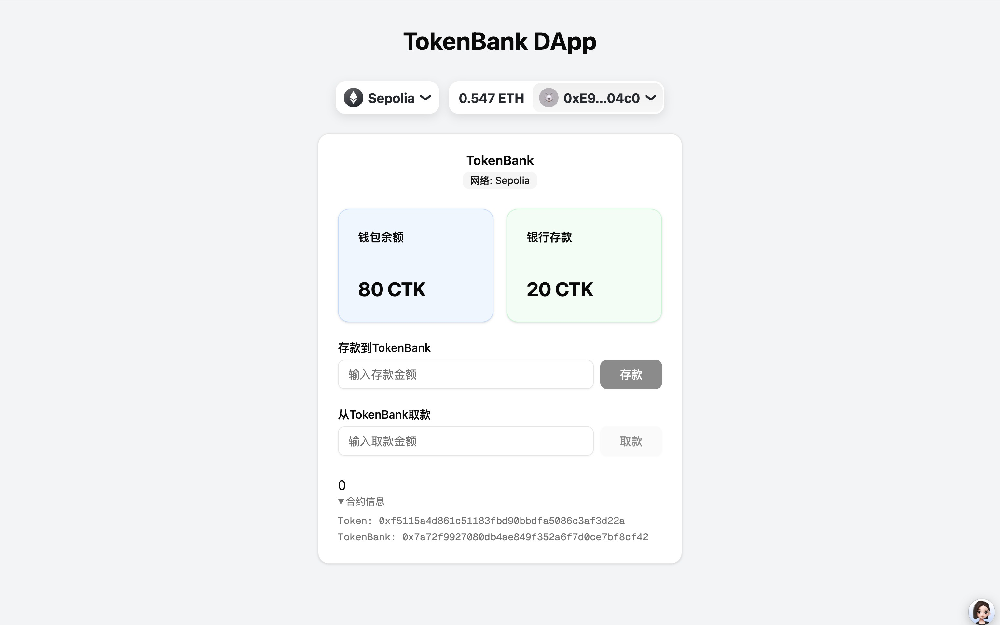

<!--
 * @Author: Mr.Car
 * @Date: 2025-07-10 08:52:43
-->
## [2.0.0] - 2025-07-15

完成一个极简的Dapp界面，增加钱包连接与和tokenBank的极简交互


# Changelog
## [1.0.4] - 2025-07-18
### 给 nftMarket 添加模糊测试与不变量测试
测试日志输出
```bash
(base) ➜  contracts git:(main) ✗ forge test --match-path test/nftMarket.t.sol -vvv
[⠊] Compiling...
[⠔] Compiling 1 files with Solc 0.8.20
[⠒] Solc 0.8.20 finished in 1.49s
Compiler run successful!

Ran 12 tests for test/nftMarket.t.sol:NFTMarketTest
[PASS] test_BuyNFT() (gas: 208974)
Logs:
  Total Supply: 100000000000000000000
  Owner token balance: 20000000000000000000
  User1 token balance: 40000000000000000000
  User2 token balance: 40000000000000000000
  测试购买NFT

[PASS] test_DelistEvent() (gas: 128371)
Logs:
  Total Supply: 100000000000000000000
  Owner token balance: 20000000000000000000
  User1 token balance: 40000000000000000000
  User2 token balance: 40000000000000000000
  测试下架事件
  要下架的 Listing ID: 1
  要下架的 Token ID: 1

[PASS] test_FuzzRandomBuyer(address,uint256) (runs: 259, μ: 225063, ~: 225072)
Logs:
  Total Supply: 100000000000000000000
  Owner token balance: 20000000000000000000
  User1 token balance: 40000000000000000000
  User2 token balance: 40000000000000000000

[PASS] test_FuzzRandomPriceListing(uint256) (runs: 259, μ: 147226, ~: 147226)
Logs:
  Total Supply: 100000000000000000000
  Owner token balance: 20000000000000000000
  User1 token balance: 40000000000000000000
  User2 token balance: 40000000000000000000

[PASS] test_InvariantMarketNeverHoldsTokens(uint256,uint256,uint256) (runs: 258, μ: 460766, ~: 460766)
Logs:
  Total Supply: 100000000000000000000
  Owner token balance: 20000000000000000000
  User1 token balance: 40000000000000000000
  User2 token balance: 40000000000000000000

[PASS] test_ListEvent() (gas: 146349)
Logs:
  Total Supply: 100000000000000000000
  Owner token balance: 20000000000000000000
  User1 token balance: 40000000000000000000
  User2 token balance: 40000000000000000000
  测试上架事件
  当前 nextListId: 0
  期望的 listId: 1
  上架后 nextListId: 1

[PASS] test_ListNFT() (gas: 145537)
Logs:
  Total Supply: 100000000000000000000
  Owner token balance: 20000000000000000000
  User1 token balance: 40000000000000000000
  User2 token balance: 40000000000000000000
  测试上架NFT

[PASS] test_RevertInsufficientPayment() (gas: 178455)
Logs:
  Total Supply: 100000000000000000000
  Owner token balance: 20000000000000000000
  User1 token balance: 40000000000000000000
  User2 token balance: 40000000000000000000
  测试支付不足

[PASS] test_RevertInvalidPrice() (gas: 21332)
Logs:
  Total Supply: 100000000000000000000
  Owner token balance: 20000000000000000000
  User1 token balance: 40000000000000000000
  User2 token balance: 40000000000000000000
  测试无效价格

[PASS] test_RevertNFTNotListed() (gas: 14720)
Logs:
  Total Supply: 100000000000000000000
  Owner token balance: 20000000000000000000
  User1 token balance: 40000000000000000000
  User2 token balance: 40000000000000000000
  测试购买未上架NFT

[PASS] test_RevertNotOwner() (gas: 18608)
Logs:
  Total Supply: 100000000000000000000
  Owner token balance: 20000000000000000000
  User1 token balance: 40000000000000000000
  User2 token balance: 40000000000000000000
  测试非所有者上架

[PASS] test_SoldEvent() (gas: 205924)
Logs:
  Total Supply: 100000000000000000000
  Owner token balance: 20000000000000000000
  User1 token balance: 40000000000000000000
  User2 token balance: 40000000000000000000
  测试售出事件
  期望的 listId: 1
  实际的 listId: 1
  Token ID: 1
  Price: 5000000000000000000
  Seller: 0x7FA9385bE102ac3EAc297483Dd6233D62b3e1496

Suite result: ok. 12 passed; 0 failed; 0 skipped; finished in 166.32ms (310.96ms CPU time)

Ran 1 test suite in 582.52ms (166.32ms CPU time): 12 tests passed, 0 failed, 0 skipped (12 total tests)
```

## [1.0.3] - 2025-07-18
### 给 Bank 添加测试
测试日志输出
```bash
(base) ➜  contracts git:(main) ✗ forge test --match-path test/bank.t.sol -vvv
[⠊] Compiling...
[⠢] Compiling 1 files with Solc 0.8.20
[⠆] Solc 0.8.20 finished in 1.20s
Compiler run successful!

Ran 6 tests for test/bank.t.sol:BankTest
[PASS] test_admin() (gas: 16921)
Logs:
  admin() -> 检查合约管理员地址是否为部署合约的地址

[PASS] test_cantSetAdmin() (gas: 18082)
Logs:
  setAdmin() -> 检查非管理员是否能够调用setAdmin()

[PASS] test_deposit() (gas: 86032)
Logs:
  deposit() -> 1. 断言检查存款前后用户在 Bank 合约中的存款额更新是否正确

[PASS] test_setAdmin() (gas: 24205)
Logs:
  setAdmin() -> 检查是否能够重新设置管理员账户为addrA

[PASS] test_topThree() (gas: 258069)
Logs:
  topThree() -> 2. 检查存款金额的前 3 名用户是否正确，分别检查有1个、2个、3个、4 个用户， 以及同一个用户多次存款的情况

[PASS] test_withdraw() (gas: 182224)
Logs:
  withdraw() -> 3. 检查只有管理员能够取钱，非管理员无法取钱
  合约总余额: 3000000000000000000
  测试非管理员 addrA 无法取钱
  测试非管理员 addrB 无法取钱
  测试管理员可以取钱
  管理员取钱前余额: 79228162514264337593543950335
  管理员取钱后余额: 79228162515764337593543950335
  合约取钱后余额: 1500000000000000000
  测试取款金额超过合约余额
  测试管理员可以取出所有余额
  取出所有余额后合约余额: 0

Suite result: ok. 6 passed; 0 failed; 0 skipped; finished in 2.89ms (4.68ms CPU time)

Ran 1 test suite in 590.06ms (2.89ms CPU time): 6 tests passed, 0 failed, 0 skipped (6 total tests)
```


## [2.0.0] - 2025-07-15
### 新增功能

- 编写一个简单的 NFTMarket 合约，使用自己发行的ERC20 扩展 Token 来买卖 NFT
- NFTMarket 的函数有：
  - `list()` : 实现上架功能，NFT 持有者可以设定一个价格（需要多少个 Token 购买该 NFT）并上架 NFT 到 NFTMarket，上架之后，其他人才可以购买

  - `buyNFT()` : 普通的购买 NFT 功能，用户转入所定价的 token 数量，获得对应的 NFT

  - 实现ERC20 扩展 Token 所要求的接收者方法 tokensReceived  ，在 tokensReceived 中实现NFT 购买功能(注意扩展的转账需要添加一个额外数据参数)

### 部署并铸造NFT(1)

```Bash
 forge script script/deployNft.s.sol:DeployNFT \
  --rpc-url $SEPOLIA_RPC \
  --private-key $NFT_PRIVATE_KEY \
  --broadcast \
  --verify \
  -vvvv
```
*日志输出：*

```Bash
Submitting verification for [src/nft.sol:CarNFT] 0xd229E8AB85614BA1F98009615394fAc3528599BA.
Submitted contract for verification:
        Response: `OK`
        GUID: `mbwciaijthg5tgmwcelkav4enffkgxbi2t78k7mzpvbncrtk2c`
        URL: https://sepolia.etherscan.io/address/0xd229e8ab85614ba1f98009615394fac3528599ba
Contract verification status:
Response: `OK`
Details: `Pass - Verified`
Contract successfully verified
All (1) contracts were verified!

Transactions saved to: /Users/car/Work/2025beginAgain/contract_bank/broadcast/deployNft.s.sol/11155111/run-latest.json

Sensitive values saved to: /Users/car/Work/2025beginAgain/contract_bank/cache/deployNft.s.sol/11155111/run-latest.json

```

*NFT地址*:
`https://testnets.opensea.io/assets/sepolia/0xd229E8AB85614BA1F98009615394fAc3528599BA/1 `

###  实现MarkerNFT合约

已经通过测试

## [1.1.2] - 2025-07-15
### 新增功能

- 扩展 ERC20 合约 ，添加一个有 hook 功能的转账函数，如函数名为：transferWithCallback ，在转账时，如果目标地址是合约地址的话，调用目标地址的 tokensReceived() 方法。

- 继承 TokenBank 编写 TokenBankV2，支持存入扩展的 ERC20 Token，用户可以直接调用 transferWithCallback 将 扩展的 ERC20 Token 存入到 TokenBankV2 中。

- 备注：TokenBankV2 需要实现 tokensReceived 来实现存款记录工作

*通过存款与取款测试：* 
```Bash
➜  contract_bank git:(main) ✗ forge test --match-contract TokenBankV2Test -vv
[⠊] Compiling...
[⠢] Compiling 2 files with Solc 0.8.20
[⠆] Solc 0.8.20 finished in 1.16s
Compiler run successful!

Ran 5 tests for test/tokenBankV2.t.sol:TokenBankV2Test
[PASS] test_tokenBalances() (gas: 36505)
Logs:
  测试 Token 余额分配

[PASS] test_tokenBankDeposit() (gas: 86593)
Logs:
  测试 TokenBank 存款功能(使用 transferWithCallback)

[PASS] test_tokenBankOwner() (gas: 23080)
Logs:
  测试 TokenBank 所有者

[PASS] test_tokenBankWithdraw() (gas: 100258)
Logs:
  测试 TokenBank 取款功能

[PASS] test_tokenBasicInfo() (gas: 28233)
Logs:
  测试 Token 基础信息

Suite result: ok. 5 passed; 0 failed; 0 skipped; finished in 2.06ms (1.21ms CPU time)

Ran 1 test suite in 568.51ms (2.06ms CPU time): 5 tests passed, 0 failed, 0 skipped (5 total tests)
➜  contract_bank git:(main) ✗ 
```

### 部署测试网并使用 Uniswap 交换

```bash
forge script script/deployToken.s.sol:DeployToken \
  --rpc-url $SEPOLIA_RPC \
  --private-key $NFT_PRIVATE_KEY \
  --broadcast \
  --verify \
  -vvvv
```

```
Submitted contract for verification:
        Response: `OK`
        GUID: `dfnjyq7mgi8rkxpspvmywds7drvjajafmexhkbghpqtrqrb4tq`
        URL: https://sepolia.etherscan.io/address/0xad36abb13d0c25e809fae580662544d87b826d98
Contract verification status:
Response: `OK`
Details: `Pass - Verified`
Contract successfully verified
All (1) contracts were verified!

Transactions saved to: /Users/car/Work/2025beginAgain/contract_bank/broadcast/deployToken.s.sol/11155111/run-latest.json

Sensitive values saved to: /Users/car/Work/2025beginAgain/contract_bank/cache/deployToken.s.sol/11155111/run-latest.json
```


## [1.1.1] - 2025-07-14

### 新增功能
- 编写一个 token 合约 CTX
- 编写一个 TokenBank 合约，可以将自己的 Token 存入到 TokenBank， 和从 TokenBank 取出
- TokenBank 有两个方法：
  - deposit() : 需要记录每个地址的存入数量；
  - withdraw() : 用户可以提取自己的之前存入的 token。

*通过存款与取款测试：* `forge test --match-path ./test/tokenBank.t.sol -vvv`
```Bash
➜  contract_bank git:(main) ✗ forge test --match-path ./test/tokenBank.t.sol -vvv
[⠊] Compiling...
[⠆] Compiling 1 files with Solc 0.8.20
[⠰] Solc 0.8.20 finished in 1.25s
Compiler run successful!

Ran 5 tests for test/tokenBank.t.sol:TokenBankTest
[PASS] test_tokenBalances() (gas: 36505)
Logs:
  测试 Token 余额分配

[PASS] test_tokenBankDeposit() (gas: 92796)
Logs:
  测试 TokenBank 存款功能

[PASS] test_tokenBankOwner() (gas: 23058)
Logs:
  测试 TokenBank 所有者

[PASS] test_tokenBankWithdraw() (gas: 100192)
Logs:
  测试 TokenBank 取款功能

[PASS] test_tokenBasicInfo() (gas: 28233)
Logs:
  测试 Token 基础信息

Suite result: ok. 5 passed; 0 failed; 0 skipped; finished in 2.05ms (1.44ms CPU time)

Ran 1 test suite in 606.83ms (2.05ms CPU time): 5 tests passed, 0 failed, 0 skipped (5 total tests)
```

## [1.1.0] - 2025-07-11

### 新增功能
- 编写 IBank 接口及BigBank 合约，使其满足 Bank 实现 IBank， BigBank 继承自 Bank 
- 要求存款金额 >0.001 ether（用modifier权限控制）
- BigBank 合约支持转移管理员
- 编写一个 Admin 合约， Admin 合约有自己的 Owner ，同时有一个取款函数 adminWithdraw(IBank bank) , adminWithdraw 中会调用 IBank 接口的 withdraw 方法从而把 bank 合约内的资金转移到 Admin 合约地址。
- BigBank 和 Admin 合约 部署后，把 BigBank 的管理员转移给 Admin 合约地址，模拟几个用户的存款，然后Admin 合约的Owner地址调用 adminWithdraw(IBank bank) 把 BigBank 的资金转移到 Admin 地址。

## [0.1.0] - 2025-07-08

### 新增功能
- 支持通过钱包直接存款到 Bank 合约
- 记录每个地址的存款金额
- 管理员可通过 `withdraw()` 方法提取资金
- 跟踪存款金额前 3 名用户

### 部署
部署脚本
```Bash
forge script script/bank.s.sol:DeployBank \
  --rpc-url $SEPOLIA_RPC \
  --private-key $NFT_PRIVATE_KEY \
  --broadcast \
  --verify \
  -vvvv
```

日志输出

```Bash                  
(base) ➜  contract_bank git:(main) ✗ forge script script/bank.s.sol:DeployBank \
  --rpc-url $SEPOLIA_RPC \
  --private-key $NFT_PRIVATE_KEY \
  --broadcast \
  --verify \
  -vvvv
[⠊] Compiling...
No files changed, compilation skipped
Warning: Detected artifacts built from source files that no longer exist. Run `forge clean` to make sure builds are in sync with project files.
 - /Users/car/Work/2025beginAgain/contract_bank/test/Counter.t.sol
 - /Users/car/Work/2025beginAgain/contract_bank/src/Counter.sol
 - /Users/car/Work/2025beginAgain/contract_bank/script/Counter.s.sol
Traces:
  [581498] DeployBank::run()
    ├─ [0] VM::envUint("NFT_PRIVATE_KEY") [staticcall]
    │   └─ ← [Return] <env var value>
    ├─ [0] VM::addr(<pk>) [staticcall]
    │   └─ ← [Return] 0xE991bC71A371055B3f02aa79b79E4b714A3D04c0
    ├─ [0] console::log("Deployer Balance", 334519602789691411 [3.345e17]) [staticcall]
    │   └─ ← [Stop]
    ├─ [0] VM::startBroadcast(<pk>)
    │   └─ ← [Return]
    ├─ [540315] → new Bank@0x19317565B2161d3F9f67E54f24e5F90fe4dfA738
    │   └─ ← [Return] 2588 bytes of code
    ├─ [0] VM::stopBroadcast()
    │   └─ ← [Return]
    └─ ← [Stop]


Script ran successfully.

== Logs ==
  Deployer Balance 334519602789691411

## Setting up 1 EVM.
==========================
Simulated On-chain Traces:

  [540315] → new Bank@0x19317565B2161d3F9f67E54f24e5F90fe4dfA738
    └─ ← [Return] 2588 bytes of code


==========================

Chain 11155111

Estimated gas price: 0.002942676 gwei

Estimated total gas used for script: 822929

Estimated amount required: 0.000002421613418004 ETH

==========================

##### sepolia
✅  [Success] Hash: 0x2a306ddbe9f789b43c4d666d9c5d409a980292f8608266381264796f8be95a97
Contract Address: 0x19317565B2161d3F9f67E54f24e5F90fe4dfA738
Block: 8733996
Paid: 0.000001193861368388 ETH (633191 gas * 0.001885468 gwei)

✅ Sequence #1 on sepolia | Total Paid: 0.000001193861368388 ETH (633191 gas * avg 0.001885468 gwei)
                                                                                   

==========================

ONCHAIN EXECUTION COMPLETE & SUCCESSFUL.
##
Start verification for (1) contracts
Start verifying contract `0x19317565B2161d3F9f67E54f24e5F90fe4dfA738` deployed on sepolia
EVM version: paris
Compiler version: 0.8.18

Submitting verification for [src/bank.sol:Bank] 0x19317565B2161d3F9f67E54f24e5F90fe4dfA738.
Warning: Could not detect the deployment.; waiting 5 seconds before trying again (4 tries remaining)

Submitting verification for [src/bank.sol:Bank] 0x19317565B2161d3F9f67E54f24e5F90fe4dfA738.
Warning: Could not detect the deployment.; waiting 5 seconds before trying again (3 tries remaining)

Submitting verification for [src/bank.sol:Bank] 0x19317565B2161d3F9f67E54f24e5F90fe4dfA738.
Warning: Could not detect the deployment.; waiting 5 seconds before trying again (2 tries remaining)

Submitting verification for [src/bank.sol:Bank] 0x19317565B2161d3F9f67E54f24e5F90fe4dfA738.
Warning: Could not detect the deployment.; waiting 5 seconds before trying again (1 tries remaining)

Submitting verification for [src/bank.sol:Bank] 0x19317565B2161d3F9f67E54f24e5F90fe4dfA738.
Warning: Could not detect the deployment.; waiting 5 seconds before trying again (0 tries remaining)

Submitting verification for [src/bank.sol:Bank] 0x19317565B2161d3F9f67E54f24e5F90fe4dfA738.
Submitted contract for verification:
        Response: `OK`
        GUID: `9iu27r7f3fza5vbps1cnvzvx9k3ejqi6k9szed9fnijpprvbey`
        URL: https://sepolia.etherscan.io/address/0x19317565b2161d3f9f67e54f24e5f90fe4dfa738
Contract verification status:
Response: `NOTOK`
Details: `Pending in queue`
Warning: Verification is still pending...; waiting 15 seconds before trying again (7 tries remaining)
Contract verification status:
Response: `OK`
Details: `Pass - Verified`
Contract successfully verified
All (1) contracts were verified!

Transactions saved to: /Users/car/Work/2025beginAgain/contract_bank/broadcast/bank.s.sol/11155111/run-latest.json

Sensitive values saved to: /Users/car/Work/2025beginAgain/contract_bank/cache/bank.s.sol/11155111/run-latest.json
```


- 测试网部署成功:
- 合约地址与scanUrl: [0x2feb07aa72860baf1951908cd20911a61b99309c#readContract](https://sepolia.etherscan.io/address/0x2feb07aa72860baf1951908cd20911a61b99309c#readContract)

